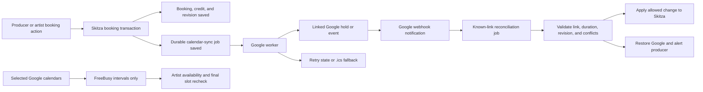

# Manual sessions and Google Calendar sync — implementation plan

**Date:** 2026-08-05

**Status:** Approved product direction; implementation has not started

**Decider:** Gili Asraf

**Development base and PR target:** `v3-clean`

**Last inspected `origin/v3-clean`:** `3653fb17fbbcc7bfee5f170aa312fea38390de35`

**Reader-tested and finalized:** 2026-08-08

## Result we want

The producer can create a confirmed Skitza session for an existing client and
one of that client's existing projects. The session immediately appears in the
producer and artist experiences, uses the project's product rules, and sends the
artist a calendar invitation.

Google Calendar remains an optional producer add-on:

- confirmed Skitza sessions create linked Google events automatically;
- selected Google calendars remove busy times from artist availability;
- allowed changes to a linked Google event sync back to Skitza;
- unrelated Google events remain private and never become Skitza sessions;
- Google failure never closes Skitza booking or cancels a Skitza session.

This document records the approved product contract and the implementation
sequence for a future set of Linear issues and PRs. It does not authorize a
production migration, merge, deployment, or promotion.

## Gili's confirmed product contract

### Producer-created manual session

- A producer may book only an existing client.
- The producer must choose one of that client's existing projects.
- The project must have a real bookable product. A session cannot float without
  a project or use a project with no session entitlement.
- The form asks for client, project, date, start time, and billing treatment.
- The title defaults from the project/product and may be edited.
- Duration is server-derived from the product entitlement snapshot. The
  producer cannot type or resize the duration.
- There is no location, note, extra-participant, recurrence, or Google Meet
  field.
- Creation immediately produces a `confirmed` Skitza session. There is no
  artist-approval step.
- The session appears in both the producer's Calendar and the artist's Skitza
  Sessions area.
- The artist is notified immediately and receives a calendar invitation.
- An included session consumes one available project session. A complimentary
  session does not consume one.
- When an included session remains, `included` is the default and
  `complimentary` is the only optional override. `billable_extra` is available
  only after the included allowance is exhausted.
- When no included session remains, the producer must explicitly choose
  `complimentary` or `billable_extra`. `billable_extra` is a stored payment-due
  label only in this scope; it does not create an invoice or charge
  automatically.
- A producer may override working hours, buffer, and daily-limit warnings.
- An overlap with another active Skitza session is a hard block.
- An overlap with unrelated Google busy time is a warning the producer may
  override.
- Repeating manual sessions are out of scope. Each session is created
  separately.
- The artist may request cancellation or rescheduling. The producer decides the
  request, subject to the booking's snapshotted cancellation policy.

### Google Calendar

- Skitza is the booking source of truth. Google Calendar is an add-on and never
  becomes another artist booking entry point.
- Only the producer connects a Google account in this scope. The artist does not
  connect Google to Skitza; the artist receives an invitation or `.ics` file.
- The producer chooses one writable destination calendar for new Skitza events
  and may choose several calendars whose busy intervals block artist
  availability.
- Skitza reads only busy intervals for unrelated Google events. It does not
  store or show their titles, descriptions, attendees, or locations.
- Any interval Google reports as busy blocks artist self-booking, including
  recurring and all-day events. Events marked free do not block it.
- When Google is first connected, Skitza creates events for future confirmed
  sessions only. Past sessions are never backfilled.
- Artist requests in `pending_approval` or `pending_payment` create private
  opaque holds with no artist attendee. Rejection or expiry removes the hold;
  confirmation promotes the same linked event.
- Confirmed sessions create Google events containing only the approved title,
  start/end, artist attendee, an artist-safe Skitza link, and private linkage
  metadata.
- No location, notes, Meet link, payment data, private files, or extra Skitza
  participants are sent to Google.
- Date, start time, and session title sync both ways for linked events.
- Duration remains the Skitza product-derived duration. Moving the whole event
  is allowed; resizing it is corrected back to the stored duration.
- A Google move that overlaps another active Skitza session is rejected. Skitza
  keeps its time, restores the Google event, and alerts the producer.
- A Google move outside normal availability or over unrelated Google busy time
  is accepted because the producer deliberately changed it.
- Deleting a linked Google event never cancels Skitza. The producer sees a
  missing-event state with `Restore event` and `Cancel session` choices.
- Cancelling in Skitza cancels/removes the linked Google event and notifies the
  artist.
- Google-only guest additions stay only in Google. They do not create Skitza
  participants or clients. The manual Skitza form itself never offers guests.
- The booked artist's Google RSVP is shown in the producer's and artist's
  Skitza session views. Declining the invitation does not cancel the session.
- Google uses each person's normal calendar reminder preferences. Skitza keeps
  its own configured session reminders and does not add custom Google reminder
  overrides.
- Disconnecting Google stops sync but leaves existing Google events in place.
  Reconnection reuses stored links and must not create duplicates.
- If Google is disconnected, unavailable, stale, or needs renewed permission,
  artist booking stays open using Skitza availability. The producer sees a
  warning; manual booking remains available.
- A Google delivery failure never rolls back a confirmed Skitza booking. Skitza
  shows `Not synced`, retries durably, and uses an `.ics` invitation fallback.
- If Skitza and Google are edited concurrently, Skitza wins and the producer is
  shown the conflict.
- Healthy changes should normally appear in the other system within one minute.

## Source precedence and narrow supersession

Gili's decisions above are newer than the conflicting calendar language in the
current PRD and therefore win.

This plan supersedes only these older rules for this scope:

- `docs/product/PRD.md` section 4.4 currently allows a manual session to attach
  to a project **or** product and requires external participants. Producer
  manual creation now requires an existing client **and** their existing
  project, with no extra participants.
- PRD sections 6.5 and 8 describe artist Google Calendar connection. This
  release connects only the producer; artist calendar delivery means a Google
  attendee invitation or `.ics` fallback, not artist OAuth.
- Older calendar placeholders may say `Coming soon`. Do not expose a functional
  connection control until OAuth, selection, delivery, failure recovery, and
  disconnect behavior work end to end.

The no-participant decision applies to producer-created manual sessions and
this Google sync scope. It does not silently remove participant behavior from a
separate future artist-booking issue.

Before code work begins, update the relevant PRD paragraphs and the execution
Linear issues with this exact contract. If a newer Gili decision or Linear issue
conflicts with this document, stop and ask Gili rather than silently choosing.

## Current repository truth

The following was inspected on 2026-08-05. Future execution must recheck the
then-current `v3-clean` because this workspace is on an unrelated dirty SK-82
branch and is not an implementation base.

- `/dashboard/calendar` has Schedule, Sessions, and Availability surfaces but
  no producer `New session` action.
- The only production booking insert path is artist self-booking. It currently
  accepts simplified availability inputs, inserts `pending_approval`, and does
  not honor every approved entitlement, timezone, blackout, or automatic
  approval rule.
- Producer calendar server actions expose confirm/reject and availability
  updates, not manual create, confirmed-session reschedule, or cancellation.
- Producer reschedule and cancellation modals are UI-only stubs.
- Artist Sessions list and detail routes still render mock session data.
- Google Calendar badges and buttons are placeholders with hard-coded
  disconnected state. There is no OAuth callback, API client, token storage,
  event mapping, free/busy query, webhook, watch renewal, or retry worker.
- `bookings` stores artist identity, project/product links, start, duration, and
  status, but not manual origin, editable session title, billing treatment,
  Google linkage, sync state, calendar revision, or artist RSVP.
- `projects.productId` is nullable. Products contain `durationMin`, but the
  approved artist booking contract requires bookability and duration snapshots
  so later product edits do not rewrite purchased entitlement.
- Availability currently considers Skitza hours and active Skitza bookings. It
  does not yet provide the complete shared, DST-safe, atomic rules needed by
  artist booking, manual preview, manual create, and Google free/busy.
- Email delivery uses Resend and React Email. There is no `.ics` generator or
  attachment path.
- The repository has `CRON_SECRET`-protected cron route patterns and `after()`
  for best-effort side effects, but no durable outbox/job system. `vercel.json`
  does not currently schedule these jobs.

## Required workflow for future execution

1. Create an umbrella Calendar initiative plus the scoped Linear issues below
   in project `Skitza v3`, team `Skitza (SK)`, or reuse exact existing issues if
   they already cover the scope.
2. For each issue: read it fully, move it to `In Progress`, start from the
   latest `v3-clean`, use Linear's exact branch name, and target `v3-clean`.
3. Do not implement this whole plan on the current dirty worktree or in one
   oversized PR.
4. Re-read current Google Calendar API documentation with Context7 before
   implementing OAuth, scopes, FreeBusy, events, push channels, and linked-event
   reconciliation.
5. Add focused failing tests before each behavior change when practical.
6. Keep Google controls hidden until their complete success and failure paths
   work. Manual sessions may ship independently after their own complete flow
   passes.
7. Use Node `>=20.11`, pnpm `9.12.0`, and Corepack.
8. For schema work, use `packages/db/src/schema.ts` as source of truth. Never
   run `drizzle-kit migrate` or `pnpm -F db db:migrate`; use `$skitza-migrate`
   with an explicit non-production target.
9. Before every PR or verified claim, run `$skitza-verify` and complete the
   browser gates in this document.
10. Do not migrate production, merge, deploy, or promote without Gili's exact
    approval for that action.

## Delivery split

Use separate Linear issues and PRs in this order. Every PR targets the latest
`v3-clean`; a later branch starts only after its prerequisite has landed.

### Issue 1 — Booking and availability domain foundation

- Land or reuse the approved `bookingEnabled` and entitlement snapshots.
- Centralize duration, credit, timezone, blackout, buffer, daily-cap, and
  overlap logic.
- Add manual-origin, billing-treatment, title, cancellation-policy snapshot,
  RSVP, and revision data.
- Make artist automatic/manual approval and credit behavior match the approved
  booking contract.

### Issue 2 — Producer manual session and real artist sessions

- Add producer manual options, preview, and create procedures.
- Add the responsive producer create-session UI.
- Replace artist session mocks with real producer-scoped data.
- Wire the agreed notification, cancellation-request, and reschedule-request
  lifecycle.
- Add `.ics` generation plus the durable, idempotent invitation-delivery outbox
  without any Google dependency. Manual sessions may ship independently only
  after this delivery path passes.

### Issue 3 — Google OAuth and calendar selection

- Add encrypted connection storage, OAuth routes, minimal scopes, connection
  status, destination-calendar selection, busy-calendar selection, reconnect,
  and disconnect.
- Keep the integration unavailable in production UI until end-to-end gates
  pass.

### Issue 4 — Google busy-time availability

- Query selected calendars through FreeBusy.
- Integrate busy intervals into artist availability and the fresh pre-transaction
  check in the final booking mutation.
- Add producer warning/override behavior and the agreed fail-open behavior.

### Issue 5 — Durable outbound event delivery

- Extend the Issue 2 delivery outbox with Google event operations. Add event
  links, retry worker, `.ics` fallback selection, pending holds, confirmation
  promotion, cancellation, reconnect deduplication, and future-session initial
  sync.

### Issue 6 — Inbound two-way sync and production hardening

- Add verified webhook handling, linked-event reconciliation, channel renewal, Google
  move/title/resize/delete/RSVP rules, conflict restoration, sync-state UI,
  observability, and the real Google browser gate.
- Only after this issue passes may the producer connection controls be exposed.

## Architecture

The booking transaction is authoritative. Google network calls never run
inside that transaction and never decide whether a Skitza booking is saved.
The same transaction that changes a booking must save its durable sync job so a
crash cannot lose the external side effect.

## Data model and migration

Names below are recommended boundaries, not permission to fork an equivalent
table that already exists when execution begins.

### Booking and entitlement fields

Extend or reuse the approved booking domain with:

- `bookings.title` — editable session display title, with a safe legacy
  fallback to the existing product/project snapshot;
- `bookings.origin` — `legacy`, `artist_request`, or `producer_manual`;
- `bookings.billingTreatment` — `included`, `complimentary`, or
  `billable_extra` for new confirmed sessions;
- `bookings.cancellationPolicyHoursSnapshot` — the rule applied to this
  booking;
- `bookings.updatedAt` and a monotonic `calendarRevision` — the Skitza-side
  concurrency version;
- booked-artist RSVP status and response timestamp, either on `bookings` or the
  one-to-one calendar link;
- `producers.maxSessionsPerDay` (nullable means no cap), unless the approved
  availability model has already landed an equivalent producer-scoped field;
- the approved entitlement/credit records and duration snapshots if they have
  not already landed from the artist booking plan.

If artist cancellation/reschedule requests have not already landed, add one
producer-scoped `booking_change_requests` table rather than overloading booking
status. It records booking ID, request kind, proposed UTC start when relevant,
request/decision timestamps, status, and the deciding producer. It contains no
free-text note in this scope.

Do not infer bookability from `durationMin`, `sessionCount`, product price, or
product type. Reuse `bookingEnabledSnapshot`, duration snapshot, finite credit,
and unlimited entitlement behavior from the approved 2026-07-30 artist plan.
For a legacy project with no duration snapshot, use the linked product duration
when valid; otherwise block manual creation until the producer fixes the
project's product. Never accept duration from the browser.

`included` consumes one credit atomically. `complimentary` and
`billable_extra` do not consume an included credit. `billable_extra` records
payment due but creates no invoice, payment processor request, or automatic
charge in this scope. When credit remains, allow `included` or an explicit
`complimentary` override; do not allow `billable_extra` until the allowance is
exhausted.

Rescheduling transfers the original credit treatment without consuming or
restoring anything. An approved future cancellation inside the snapshotted
policy window, or a producer-initiated cancellation, restores one consumed
included credit. Complimentary and billable-extra sessions have no credit to
restore. Completed sessions never restore credit, and an artist request outside
the policy window cannot self-cancel.

### Google connection data

Add a `google_calendar_connections` table with one active row per producer:

- producer ID with a unique constraint;
- Google subject and account-email snapshot;
- encrypted refresh/access credential material and access-token expiry;
- granted-scope snapshot;
- connection state: `needs_selection`, `connected`, `reconnect_required`, or
  `disconnected`;
- last successful availability check, last successful event sync, safe error
  code, and timestamps.

Add `google_calendar_selections` rows for calendars visible to the connection:

- opaque Google calendar ID;
- display-name and timezone snapshots for the producer selection UI;
- last known access role;
- `blocksAvailability`;
- `isDestination`, with a partial unique index enforcing **at most one**
  destination per connection. The calendar-selection transaction must require
  exactly one writable destination before it marks the connection `connected`.

Do not store ordinary Google event data in these tables.

### Linked events, watches, and durable work

Add `booking_calendar_links` with one active Google link per booking:

- booking, connection, and producer IDs;
- Google calendar and event IDs with a uniqueness constraint;
- event kind: `hold` or `confirmed`;
- Google etag/updated timestamp;
- last applied Skitza revision;
- state: `pending`, `synced`, `not_synced`, `conflict`, `missing`, or
  `disconnected`;
- invitation delivery channel (`google` or `ics`), delivered revision, and
  delivery timestamp so retries cannot send the same invite twice;
- safe last-error code and last-sync timestamp.

Add `google_calendar_watches` per watched calendar:

- channel ID, Google resource ID, token hash, calendar ID, and expiration;
- last notification and last known-link reconciliation timestamps;
- active/renewing/expired state.

Add `calendar_sync_jobs` as a transactional outbox:

- operation kind, booking/link/connection references, desired Skitza revision,
  idempotency key, attempt count, next-attempt time, lock/lease timestamps,
  completion time, and safe error code;
- a uniqueness constraint on the idempotency key;
- bounded exponential backoff and a terminal state that remains manually
  retryable.

Land the base table and `send_ics`/invitation operation in Issue 2. Issue 5 adds
Google upsert/delete/reconcile operations to the same durable mechanism rather
than introducing a second outbox.

Use an app-generated, provider-compatible stable event ID plus private Google
extended properties containing only the Skitza booking ID and link version.
This makes create retries and reconnect reconciliation idempotent without
putting client or project data in metadata.

### Migration and backfill rules

- Migrations are additive. Do not remove or reinterpret legacy booking rows.
- Mark existing booking origins as `legacy`; new artist and manual writes stamp
  their real origin.
- Backfill titles and entitlement snapshots only where the source is
  unambiguous. Keep application fallbacks for unresolved legacy rows.
- Do not create Google events during a database migration. Initial future-event
  creation happens only after a producer connects and selects a destination.
- Apply and verify migrations against an explicit disposable/non-production
  target with `$skitza-migrate`.

## Implementation details

### 1. Centralize the booking rules first

Create a shared server-only booking domain under
`apps/web/src/server/booking/` and make artist booking and manual booking use it.
It owns:

- entitlement selection and remaining-credit calculation;
- product-derived duration snapshot selection;
- IANA timezone and DST conversion;
- recurring availability blocks, date blackouts, buffer, lead time, and daily
  cap;
- active-Skitza-session overlap detection;
- normalization of Google busy intervals;
- warning versus hard-conflict classification;
- a final transaction-time recheck under the existing producer/project
  advisory-lock pattern.

Fix the current artist-booking hard-coded/simplified duration and availability
paths as part of this extraction. Do not maintain separate manual, artist, and
Google scheduling engines.

The final server mutation, not the preview UI, decides whether a slot can be
saved. A stale browser preview must not bypass a new Skitza conflict or consume
the same credit twice.

### 2. Implement producer manual creation

Add focused procedures to the existing booking router:

- `booking.manual.options` — producer-scoped existing clients and their
  eligible existing projects;
- `booking.manual.preview` — server-derived title/duration, remaining credit,
  hard conflicts, and overrideable warnings;
- `booking.manual.create` — the authoritative transaction.

The create input may contain only IDs, UTC start instant, optional title,
billing treatment, and explicit warning acknowledgement. Never accept artist
identity, product ID, duration, location, notes, participants, or price from the
browser.

Inside one producer/project-locked transaction:

1. Resolve the contact, project, entitlement, and product under
   `ctx.producerId`.
2. Prove the project belongs to the selected existing contact using the
   repository's current producer-scoped client/project relationship.
3. Derive artist identity, product, title fallback, duration, and cancellation
   policy on the server.
4. Recalculate credit and every Skitza conflict.
5. Hard-block another active Skitza session.
6. When credit remains, default to `included`, allow an explicit
   `complimentary` override, and reject `billable_extra`. When no finite credit
   remains, reject `included` and require `complimentary` or `billable_extra`.
7. Insert the booking immediately as `confirmed`, consume a credit only for
   `included`, and create the durable calendar job in the same transaction.
8. Emit producer/artist application notifications idempotently after commit.

Add a `New session` action to the producer Calendar and a responsive
`manual-session-modal.tsx`. The modal filters project choices after client
selection, displays the derived duration read-only, explains the selected
billing treatment, and requires a second confirmation only for overrideable
availability or Google-busy warnings.

Use the existing button and modal rules. Verify desktop and true 390px/360px
layouts independently.

### 3. Replace artist session mocks and wire lifecycle actions

Add real artist-scoped session list/detail procedures using the established
`clientContacts.clerkUserId` plus producer/email ownership guards. An artist
must never enumerate another contact's booking by UUID.

Replace mock data in:

- `apps/web/src/app/(artist)/artist/sessions/page.tsx`;
- `apps/web/src/app/(artist)/artist/sessions/[sessionId]/page.tsx`.

Show manual sessions exactly like other real sessions, including title,
product-derived duration, status, studio/artist timezone display, billing label
when appropriate, and Google RSVP state.

Wire the existing producer reschedule and cancellation stubs to real mutations.
Add the artist request path required by the approved contract. A reschedule
transfers the original credit and Google link; it never consumes a second
credit. An allowed future cancellation restores an included credit according
to the approved entitlement rules and never moves money automatically.

Only date, start/duration consequences, title, cancellation, and RSVP changes
surface as session updates. There are no note, location, Meet, or participant
controls in this scope.

### 4. Add calendar invitation fallback

Add a small RFC 5545 generator under `apps/web/src/server/calendar/ics.ts` with
a stable UID per booking, UTC timestamps, escaped title text, producer
organizer, artist attendee, and `SEQUENCE = calendarRevision`. New and
rescheduled invitations use `METHOD:REQUEST`; cancellation reuses the same UID
with a higher sequence plus `METHOD:CANCEL` and `STATUS:CANCELLED`. Retrying the
same revision must produce the same semantic invitation, not a new event.

Extend the current Resend path to support a calendar attachment. Delivery must
avoid duplicate invitations:

- when Google successfully creates/promotes the event with
  `sendUpdates=all`, Google is the calendar invitation and the Skitza email does
  not attach a second invite;
- when Google is not connected or the bounded initial delivery fails, Skitza
  sends the `.ics` invitation and leaves the durable Google retry active;
- after `.ics` fallback, a later Google create/update for the same booking
  revision uses the existing attendee with `sendUpdates=none`; it must not send
  a second invitation. A later material session revision may notify once.

If Google needs a visible Skitza link, use a fixed system-generated URL only.
Do not map any free-form note into the Google description field.

Email or Google failure is recorded and retryable; neither rolls back the
confirmed booking.

### 5. Implement secure producer OAuth and selection

Add a server-only Google Calendar integration boundary, for example:

- `apps/web/src/server/google-calendar/client.ts`;
- `oauth.ts`;
- `crypto.ts`;
- `freebusy.ts`;
- `events.ts`;
- `sync.ts`;
- `jobs.ts`.

Use the official REST API directly unless the executor proves the official
client materially reduces risk without adding unwanted weight. Keep all
provider shapes inside this boundary.

Add route handlers for:

- `/api/integrations/google-calendar/connect`;
- `/api/integrations/google-calendar/callback`;
- `/api/webhooks/google-calendar`;
- `/api/cron/calendar-sync`.

OAuth requirements:

- signed, short-lived, single-use state tied to the authenticated producer;
- PKCE where supported by the selected web-server flow;
- offline access and safe refresh-token preservation on reconnect;
- minimal scopes for calendar-list read, FreeBusy, and event write/watch;
- encrypted token storage using a dedicated server-only AES-GCM key with key
  versioning;
- no token, authorization code, webhook token, unrelated event data, or client
  detail in logs;
- callback redirect URIs allowlisted to the configured Skitza origin;
- explicit handling for denied consent, missing refresh token, revoked access,
  wrong Google account, and writable-calendar loss.

The selection UI lists calendar name, timezone, and access role. Only a
`writer`/`owner` calendar may be the destination. Read/free-busy calendars may
be selected separately. The producer's existing primary calendar is the
initial suggestion, not an irreversible default.

Changing the destination affects newly created links only. Existing linked
events stay on their recorded calendar and remain watched until no future
active link needs that calendar. Do not silently move existing events between
Google calendars or resend their invitations.

Disconnect attempts provider token revocation, deletes encrypted active
credentials, marks the connection disconnected, stops watches, and preserves
non-secret event links so reconnect can deduplicate. It never deletes existing
Google events.

Automatic reconnect and link reuse require the same Google subject. A different
Google account is an explicit account switch: preserve the old disconnected
links, do not claim their event IDs belong to the new account, and require a
separate confirmation before creating future-session events in the new account.
The same-account reconnect path is the one required to be duplicate-free.

### 6. Add Google busy intervals to availability

Use `POST /calendar/v3/freeBusy` for the selected calendars and requested
booking window. This endpoint returns time intervals without requiring Skitza
to fetch or persist personal event details.

Apply Google busy intervals in two places:

1. artist availability generation, where they remove offered slots;
2. the final artist/manual mutation, which performs a fresh FreeBusy request
   immediately before opening the database transaction. Never reuse the page's
   earlier preview response for this final check.

Do not make a Google network request while holding a database transaction or
advisory lock. The locked transaction rechecks Skitza conflicts and credits
using the fresh FreeBusy result obtained by the same mutation. A Google event
can still be created in the small interval between that request and commit;
this unavoidable provider race is accepted because Google is a fail-open
add-on. The next health/reconciliation pass warns the producer rather than
rolling back the Skitza booking.

Behavior by actor:

- artist self-booking: current Google busy is a hard conflict;
- producer manual creation: Google busy is an overrideable warning;
- Google disconnected/failed/stale: continue with Skitza-only availability and
  record a producer-visible warning.

Do not silently substitute fixed-offset or browser-local time math. Send RFC
3339 instants, preserve the producer's IANA studio timezone, render the artist's
IANA timezone, and test DST boundaries.

### 7. Deliver linked Google events through a durable outbox

Every booking/status/title/start change increments `calendarRevision` and
inserts an idempotent sync job in the same transaction. `after()` may wake a
best-effort fast dispatcher, but a `CRON_SECRET`-protected worker is the durable
recovery path and renews expired watches.

Outbound mapping:

| Skitza state                           | Google behavior                                                               |
| -------------------------------------- | ----------------------------------------------------------------------------- |
| `pending_approval` / `pending_payment` | Private opaque hold, no attendee, no attendee email                           |
| `confirmed`                            | Create or promote the linked event; add artist attendee; send material update |
| title/start change                     | Patch the same linked event idempotently                                      |
| rejected/expired pending request       | Delete the private hold                                                       |
| cancelled                              | Cancel/delete linked event and send attendee update                           |
| disconnected/error                     | Keep Skitza state, mark link, retry or use `.ics`                             |

Initial connection enqueues jobs only for future confirmed bookings. It never
runs network calls from a migration or copies old history.

A Google hold has no independent Google-only expiry. It mirrors the Skitza
booking's approval/payment expiry or explicit status transition; when that
booking becomes rejected, expired, or cancelled, the linked hold is removed.
Initial backfill creates pre-existing future events with `sendUpdates=none`.
It must not resend invitations, even when legacy rows do not have reliable
delivery history. New sessions created after connection use the normal one-time
invitation path.

The worker must be safe under duplicate delivery, concurrent workers, request
timeouts, provider 429/5xx responses, and process death after Google succeeds
but before the job is marked complete. Stable event IDs, extended properties,
etags, and idempotency keys prevent duplicates.

### 8. Receive and validate Google changes

Google push notifications do not contain the changed event. The webhook must:

1. validate the channel ID, resource ID, and stored channel-token hash;
2. return quickly after inserting a deduplicated known-link reconciliation job;
3. select only active `booking_calendar_links` for that watched calendar;
4. fetch those known Google event IDs individually with etag/conditional
   requests in bounded batches;
5. treat a linked-event `404` as the approved missing-event state;
6. renew expiring watch channels with a new unique channel ID.

Do not use an unfiltered calendar-wide `events.list` incremental pull in this
scope. It could read unrelated event payloads and would violate the approved
privacy boundary. A notification caused by an unrelated Google event may wake
the worker, but the worker reconciles only IDs already linked to Skitza. A
periodic cron performs the same bounded known-link reconciliation so a missed
push notification cannot leave linked events stale forever.

Only events already linked to a Skitza booking may change a Skitza session.
Unlinked Google events never create clients, projects, or sessions.

Inbound rules:

- title change: apply only when no newer unsynced Skitza revision exists;
- whole-event move: apply the new start after a locked Skitza conflict check;
- resize: keep the stored Skitza duration and enqueue a corrective Google
  patch;
- combined move and resize: accept the new start when conflict-free, then
  restore only the end time to the fixed Skitza duration;
- overlap with active Skitza session: reject, retain Skitza, restore Google,
  and alert the producer;
- deletion: mark `missing`, retain the booking, and expose Restore/Cancel;
- booked-artist RSVP: update display state only; never change booking status;
- Google-only attendee changes: ignore in Skitza;
- simultaneous/out-of-order change: the newest unapplied Skitza revision wins.

Store only linked-event fields required by this contract. Never persist
unrelated Google event summaries or payloads.

### 9. Surface connection and sync health

Replace placeholder badges only after the full flow works. Producer states:

- Not connected;
- Connecting / calendar selection required;
- Connected and healthy;
- Syncing;
- Reconnect required;
- Session not synced;
- Google event missing;
- Sync conflict.

Provide bounded actions: Connect, Choose calendars, Retry, Reconnect,
Disconnect, Restore event, and Cancel session. Do not expose raw Google errors,
tokens, calendar IDs, or internal retry details.

An unhealthy add-on never disables artist or manual booking. It may reduce
Google-aware blocking until recovery, and the producer warning must say that
plainly.

### 10. Configure background execution and operational safety

Add the calendar worker and channel-renewal schedule to the deployment config;
do not assume that adding a route schedules it. Make processing observable with
structured, non-sensitive counters for queued, succeeded, retried, terminal,
reconnected, known-link-reconciled, conflict-restored, and fallback-invite
jobs.

Alert on:

- a growing oldest-job age;
- repeated OAuth refresh failure;
- expiring watches that were not renewed;
- known-link reconciliation repeatedly exceeding its bounded work window;
- duplicate-event prevention firing;
- invitation delivery terminal failure.

Keep logs free of access/refresh tokens, webhook secrets, unrelated event
details, artist email, project names, and provider response bodies that may
contain personal data.

## Expected file boundary

Exact names may adjust to current `v3-clean`, but the work should remain within
these domains unless a failing test proves one more dependency is required.

### Existing files likely modified

- `packages/db/src/schema.ts`
- `packages/db/drizzle/<next>_*.sql`
- `apps/web/.env.example`
- `apps/web/.env.local.example`
- `apps/web/src/server/trpc/routers/booking.ts`
- `apps/web/src/server/trpc/routers/artist.ts`
- `apps/web/src/server/trpc/routers/_app.ts`
- `apps/web/src/app/(producer)/dashboard/calendar/page.tsx`
- `apps/web/src/app/(producer)/dashboard/calendar/calendar-actions.ts`
- producer calendar schedule/session panels and modal stubs
- `apps/web/src/app/(producer)/dashboard/booking/gcal-sync-badge.tsx`
- `apps/web/src/app/(producer)/dashboard/settings/settings-client.tsx`
- `apps/web/src/app/(artist)/artist/sessions/page.tsx`
- `apps/web/src/app/(artist)/artist/sessions/[sessionId]/page.tsx`
- artist session screens and tests
- `apps/web/src/server/email/client.ts`
- `apps/web/src/server/email/send.tsx`
- deployment cron configuration
- `docs/product/PRD.md`

### New boundaries likely added

- `apps/web/src/server/booking/`
- `apps/web/src/server/google-calendar/`
- `apps/web/src/server/calendar/ics.ts`
- `apps/web/src/server/trpc/routers/google-calendar.ts`
- OAuth connect/callback, Google webhook, and calendar cron route handlers
- producer manual-session modal and focused tests
- database migration and Google/manual-booking router tests

Do not modify unrelated navigation, payments, files, product design, or artist
authentication.

## Automated regression matrix

Every row needs a focused automated test unless marked Browser/Integration.

| Area                | Case                                                   | Expected result                                                       |
| ------------------- | ------------------------------------------------------ | --------------------------------------------------------------------- |
| Manual auth         | Another producer's client/project IDs                  | `NOT_FOUND`/`FORBIDDEN`; no data leak                                 |
| Manual eligibility  | Client exists but project does not belong to client    | Blocked                                                               |
| Manual eligibility  | Project has no bookable product/duration snapshot      | Blocked with repair guidance                                          |
| Manual duration     | Browser submits/changes duration                       | Ignored or rejected; server snapshot wins                             |
| Manual credit       | Included credit available                              | Confirmed and exactly one credit consumed                             |
| Manual credit       | Billable extra selected while credit remains           | Rejected; use included or explicit complimentary                      |
| Manual credit       | No included credit remains                             | Included blocked; complimentary/billable-extra allowed                |
| Manual credit       | Complimentary/billable extra                           | No included credit consumed; no automatic charge/invoice              |
| Session lifecycle   | Reschedule                                             | Same credit treatment transfers; no second consumption                |
| Session lifecycle   | Allowed future or producer cancellation                | Included credit restored once; completed never restores               |
| Manual conflict     | Active Skitza overlap                                  | Hard block inside locked transaction                                  |
| Manual warning      | Outside hours/buffer/cap                               | Explicit warning; producer may override                               |
| Manual warning      | Google busy overlap                                    | Explicit warning; producer may override                               |
| Artist view         | Manual session belongs to signed-in contact            | Visible in list/detail with correct studio timezone                   |
| Artist auth         | Different contact guesses booking UUID                 | Not found                                                             |
| Invite              | Google connected and event succeeds                    | One Google invitation; no duplicate `.ics` invite                     |
| Invite              | Google absent/fails                                    | Booking stays confirmed; valid `.ics` delivered; retry remains        |
| Invite              | Reschedule/cancel after `.ics`                         | Same UID, higher sequence, correct REQUEST/CANCEL; no duplicate event |
| Availability        | Busy/free/all-day/recurring Google intervals           | Only Google-busy instants remove artist slots                         |
| Availability        | FreeBusy unavailable/revoked                           | Skitza-only slots remain open; producer health warning                |
| Availability        | DST boundary                                           | Correct UTC instants and artist/studio labels                         |
| Outbound hold       | Pending request                                        | Private opaque hold; no artist attendee                               |
| Outbound confirm    | Held request confirms                                  | Same event promoted; attendee invited once                            |
| Outbound cancel     | Confirmed session cancels                              | Linked event removed/cancelled; artist updated                        |
| Outbound retry      | Duplicate worker/retry after provider success          | One Google event only                                                 |
| Initial sync        | Connect with past and future sessions                  | Future confirmed only; no past events                                 |
| Inbound move        | Free new time                                          | Skitza start changes; duration preserved                              |
| Inbound resize      | Google end time changes                                | Skitza duration unchanged; Google corrected                           |
| Inbound move+resize | Start and end both change                              | Conflict-free start accepted; end corrected to fixed duration         |
| Inbound conflict    | Move overlaps active Skitza session                    | Skitza wins; Google restored; producer warned                         |
| Inbound delete      | Linked event deleted                                   | Booking remains; link marked missing; Restore/Cancel shown            |
| RSVP                | Artist accepts/declines/tentative                      | Response shown both sides; booking remains confirmed                  |
| Guests              | Guest added in Google                                  | Guest remains Google-only                                             |
| Webhook             | Wrong channel/resource/token                           | Rejected without sync work                                            |
| Webhook             | Duplicate/out-of-order notification                    | Idempotent result                                                     |
| Privacy             | Unrelated event triggers watched-calendar notification | Only known linked IDs are fetched; unrelated payload is not read      |
| Reconciliation      | Linked event webhook is missed                         | Periodic known-link pass converges safely                             |
| Watch lifecycle     | Channel approaches expiry                              | New channel created and old one retired safely                        |
| Concurrency         | Skitza and Google edit together                        | Skitza revision wins; visible conflict state                          |
| Disconnect          | Disconnect/reconnect same account                      | Events remain; links reused; no duplicates                            |
| Disconnect          | Connect a different Google subject                     | Old links preserved but never reused as the new account's IDs         |
| Browser             | Producer manual-create flow at desktop/390/360         | Complete, no overflow/error/dead control                              |
| Integration         | Real Google OAuth, busy, move, delete, reconnect       | End-to-end contract passes in non-production                          |

## Verification

### Focused automation

Future execution must add and run focused tests for:

- booking-domain interval, timezone, credit, and warning functions;
- manual options/preview/create authorization and transaction behavior;
- artist session list/detail authorization;
- cancellation/reschedule credit transfer;
- RFC 5545 generation and email attachment behavior;
- token encryption/decryption and key-version handling;
- OAuth state, callback, denied consent, token refresh, and reconnect;
- FreeBusy normalization and fail-open behavior;
- event mapping, hold promotion, idempotent create/update/delete, and attendee
  response;
- webhook verification, deduplication, bounded known-link reconciliation,
  missed-notification recovery, and watch renewal;
- sync worker retry, lease recovery, terminal failure, and reconnect
  reconciliation;
- producer and artist connection/RSVP/sync-state UI.

Then run `$skitza-verify` for typecheck, lint, focused/full tests, production
build, and browser verification. Do not hide baseline failures.

### Real browser and provider gates

Use a disposable non-production Google Cloud OAuth client, test Google account,
database, and email recipient. Never use the production database for this gate.

Verify at minimum:

1. Existing client/project manual booking becomes immediately confirmed with
   product-derived duration and correct credit treatment, appears in producer
   and artist views, and delivers one usable calendar invitation.
2. Google busy removes artist availability; producer manual creation can
   override it; another Skitza session remains a hard block.
3. Moving a linked event updates Skitza, resizing is corrected, and a Skitza
   collision restores Google.
4. Deleting a linked event leaves the Skitza booking and exposes Restore/Cancel.
5. Google failure/disconnect leaves booking open, marks Not synced, delivers
   `.ics`, and reconnects without a duplicate.
6. Pending hold, confirmation promotion, RSVP display, cancellation, channel
   renewal, and periodic known-link recovery behave as documented.

Run the producer flow on desktop and true 390px/360px layouts. Check the artist
session/invitation result separately. Fail verification on an unexpected
same-site 4xx/5xx, failed request, console error, page error, dead control,
horizontal overflow, duplicate invite, or duplicate Google event.

If a safe real Google OAuth/webhook/email loop is unavailable, report
`PARTIAL`; mocked API tests are not enough to claim the integration verified.

## Acceptance criteria

- A producer can create a confirmed session only for an existing client and
  that client's eligible existing project.
- Manual input cannot override artist identity, product, duration, entitlement,
  or producer ownership.
- Included, complimentary, and billable-extra treatments match the approved
  credit behavior and never auto-charge.
- Another Skitza session always hard-blocks creation under concurrency.
- Availability/Google-busy warnings are explicit and producer-overridable.
- The real session appears in both producer and authorized artist views.
- Artist notification and invitation delivery are idempotent and recoverable.
- Unrelated Google events never become Skitza records and their private details
  are never stored or displayed.
- Selected Google busy intervals remove artist slots while provider failure
  leaves booking open.
- Confirmed sessions, pending holds, changes, cancellations, first connection,
  disconnect, and reconnect follow the approved event lifecycle.
- Google resizing cannot change product-derived duration.
- Google deletion cannot cancel Skitza.
- The primary artist RSVP appears in both Skitza views without changing booking
  status.
- Google-only guests remain Google-only.
- OAuth credentials and webhook trust data are protected and never logged.
- Duplicate webhook, retry, reconnect, and crash-recovery paths create at most
  one linked event.
- Healthy sync normally converges within one minute.
- Focused tests, `$skitza-verify`, and the real non-production browser/provider
  gate pass before handoff; otherwise the result is reported `PARTIAL` or
  `FAILED`.

## Explicit exclusions

- Google Appointment Schedule or any second artist booking entry point.
- Artist Google OAuth or artist-owned two-way calendar sync.
- Importing ordinary Google events as Skitza sessions, clients, or projects.
- Creating a new client, project, or product from the manual-session form.
- Floating sessions not tied to an eligible existing project.
- Manual location, notes, participants, recurrence, or Google Meet.
- Syncing Google-only guest changes into Skitza.
- Letting Google resize product-derived duration.
- Automatic invoice creation, automatic payment charge, refund, or payment
  movement for a manual session.
- Closing artist booking because Google is unhealthy.
- Outlook, Apple Calendar, native phone-calendar integration, or generic CalDAV.
- Unrelated Calendar visual redesign, product redesign, payment redesign, or
  artist authentication work.
- Production migration, merge, deployment, or promotion without Gili's separate
  approval.

## Rollout and rollback

### Rollout

1. Land additive schema/domain work with Google UI still hidden.
2. Ship and verify manual sessions independently.
3. Enable Google connection only for an internal/test producer in a disposable
   environment.
4. Complete OAuth verification, real event/FreeBusy/webhook testing, retry and
   channel-renewal soak, and privacy review.
5. Expose the connection UI only after the full integration reports `VERIFIED`.
6. Ask Gili separately before any production migration, deployment, or domain
   promotion.

### Rollback

- Disable the Google connection capability first; do not delete producer Google
  events during rollback.
- Stop new sync jobs and watch renewal, then let in-flight leases expire safely.
- Preserve booking/event links and non-secret reconciliation identifiers so a
  later reconnect does not duplicate events.
- Manual Skitza sessions remain normal bookings even if Google code is disabled.
- Revert application PRs in reverse dependency order. Additive schema columns
  and tables may remain dormant until a separately approved cleanup; do not run
  destructive production rollback migrations casually.

## External prerequisites

- A Google Cloud project owned by Skitza, Calendar API enabled.
- OAuth consent screen, verified domains, privacy-policy/support URLs, and the
  required Google verification for the chosen scopes.
- Separate local/preview/production OAuth client IDs and exact redirect URIs.
- Public HTTPS webhook URL with a valid certificate.
- Server secrets for Google OAuth, token encryption key/version, webhook trust,
  and cron authorization.
- A disposable test producer Google account/calendar and non-production email
  recipient.
- Deployment cron configuration for outbox drain and watch renewal.

Never put credentials, database URLs, access/refresh tokens, or webhook secrets
in this document, commits, tests, screenshots, or logs.

## Source references

- `AGENTS.md`
- `docs/product/PRD.md`, especially sections 4.4, 6.5, and 8
- `docs/plans/active/2026-07-30-artist-platform-professional-ui-ux.md`,
  especially booking eligibility, duration snapshots, credits, timezone,
  cancellation, and calendar delivery
- `packages/db/src/schema.ts`
- `apps/web/src/server/trpc/routers/booking.ts`
- `apps/web/src/server/trpc/routers/artist.ts`
- `apps/web/src/app/(producer)/dashboard/calendar/`
- `apps/web/src/app/(artist)/artist/sessions/`
- Google Calendar API: OAuth/authentication, CalendarList, FreeBusy, Events,
  push notifications, watch renewal, and event lookup documentation at
  `https://developers.google.com/workspace/calendar/api/`
