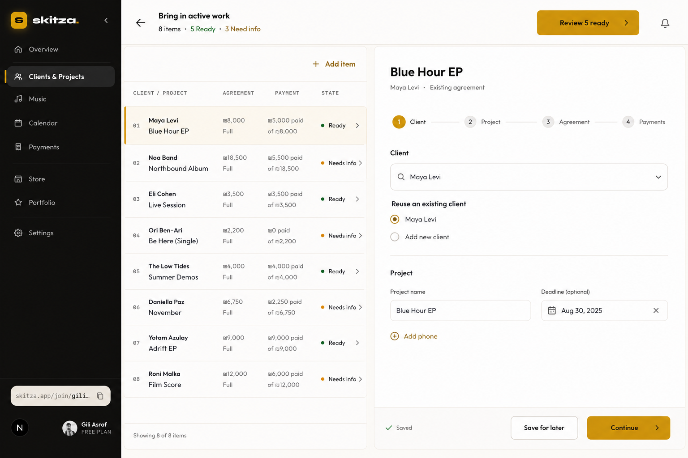
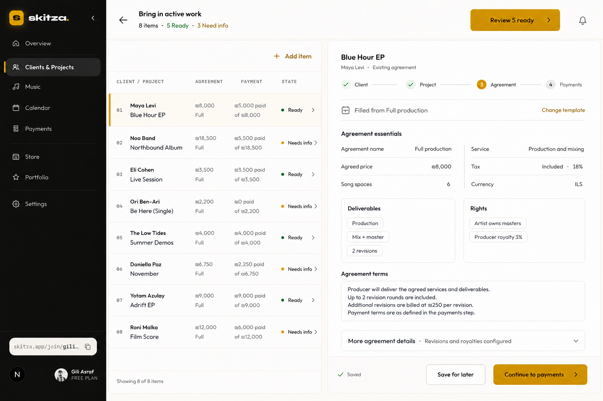
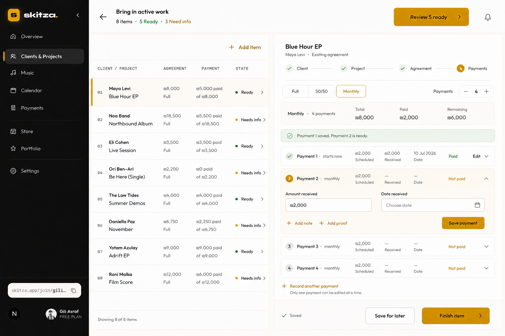
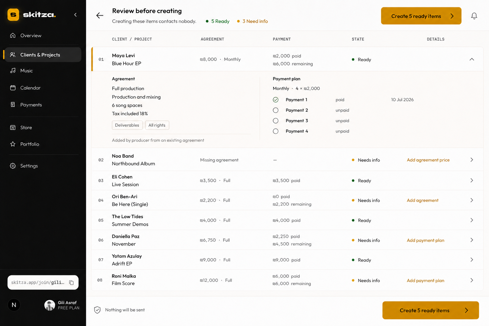
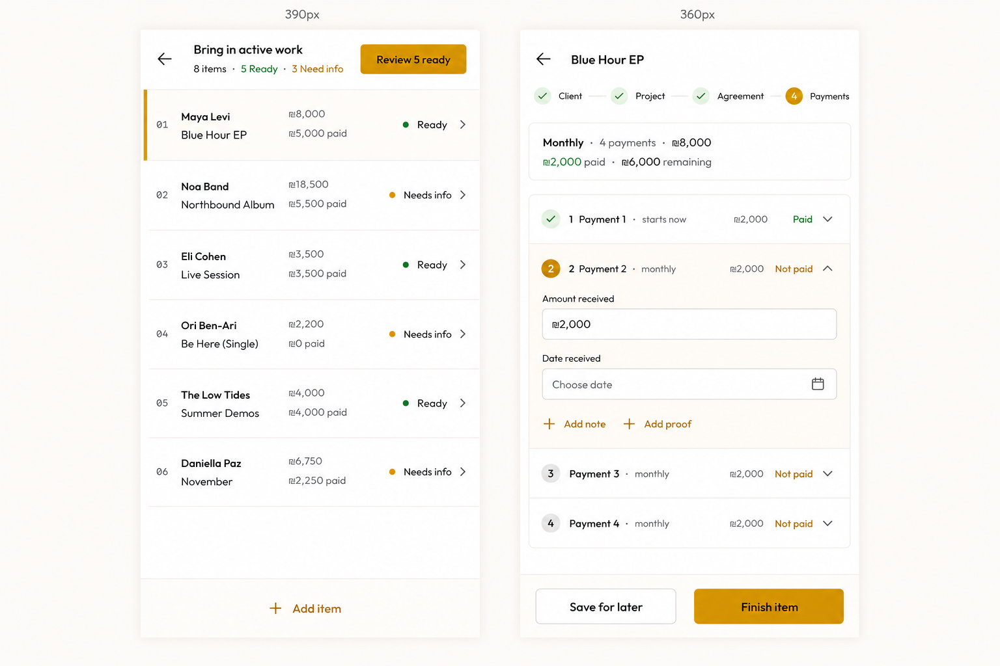

# SK-255 compact import UX implementation handoff

**Approved by:** Gili
**Date:** 21 August 2026
**Status:** Approved implementation direction
**Scope:** UI/UX correction inside SK-255 only

> **Latest visual correction — 21 August 2026:**
> `2026-08-21-sk-255-final-visual-source-of-truth.md` supersedes this
> document for visual presentation, responsive integration, screenshot proof,
> and the final verification gate. The behavior and safety rules below remain
> authoritative. The images in this document are historical density/state
> references only and are not accepted proof of the finished Skitza design.

## Authority and source order

For this redesign, use sources in this order:

1. Gili's latest explicit decision.
2. `docs/plans/active/2026-08-21-sk-255-final-visual-source-of-truth.md`.
3. This handoff for compact three-step behavior and edge cases.
4. `docs/plans/active/2026-08-20-sk-255-ux-grill.md`.
5. Linear SK-255 and its attached audited plan for domain rules.
6. `docs/product/PRD.md` for durable product rules.
7. Current code for actual contracts and preserved behavior.

This handoff replaces the earlier four-step presentation with three steps:

**Client & Project → Agreement → Payments**

Client and Project are one short step because they are entered together and the
approved visual already treats them as one focused task. This is a presentation
change only. It does not change Client or Project ownership, identity, creation,
or persistence rules.

The generated mockups preserve useful state and density intent, but they are no
longer the visual target and cannot satisfy the final screenshot gate. If any
mockup conflicts with the final visual source of truth, Linear, PRD, or current
domain rules, keep the higher authority.

## Outcome

Make Bring in active work feel like a fast, premium studio setup tool:

- a real compact work table on desktop;
- one focused, short editor step at a time;
- very little empty vertical space;
- optional information revealed only when needed;
- one obvious next action;
- exact drafts, agreement facts, payments, and safety rules preserved;
- mobile queue first, followed by a full-screen editor;
- no accidental invitation, reminder, or Artist-acceptance claim.

This is not a marketing page and not a long settings form.

## Historical density and state references

### 1. Compact workspace and combined Client & Project step

### 2. Compact Agreement step

### 3. Compact Payments step

### 4. Compact Review

### 5. Mobile queue and editor

## Non-negotiable product rules

- The per-item flow has exactly three visible steps:
  **Client & Project → Agreement → Payments**.
- Creating and autosaving rows contacts nobody.
- Imported terms say **Added by producer from an existing agreement**.
- Never fabricate Artist acceptance, signature, time, or accepting user.
- Historical producer-entered money says **Confirmed by producer**.
- Historical payment date is real and required. Never guess it.
- Payment proof and note are optional.
- Full, 50/50, and Monthly are the only plans.
- The final 50/50 installment stays locked until exact Artist approval.
- One incomplete or failed row never rolls back a successful row.
- Drafts, proof choices, and retry state survive navigation and reload.
- Invitations remain optional after silent creation.
- Finish setup automatically enables reminders for every eligible unpaid
  imported installment. The user cannot turn them off in setup.
- A final 50/50 reminder remains silent until Artist approval makes it due.
- Existing ownership, access, download, payment, invitation, approval, and
  identity rules stay unchanged.
- No schema, migration, or server-domain expansion is expected for this visual
  redesign. Stop and report before changing those areas.

## Desktop layout

### Shell

- Keep the existing Skitza black navigation and dashboard top bar.
- Use the existing warm cream page, light work surfaces, near-black text,
  stronger borders, and mustard action token.
- No gradient, glow, shine, confetti, or decorative marketing hero.
- Page content must fit below the dashboard header without creating a second
  page-sized document.

### Compact page header

- One compact row contains:
  - Back action and **Bring in active work**.
  - Progress: **8 items · 5 Ready · 3 Need info**.
  - One mustard action: **Review 5 ready**.
- Do not restore statistic cards or a giant page title.

### Two-pane workspace

- Desktop uses approximately 40% queue and 60% editor.
- Use the existing spacing scale: compact outer gap, `p-4`-level work-surface
  padding, and thin dividers.
- Both panes fill the available viewport height.
- Queue and editor field body scroll independently.
- Item title, three-step navigation, and action footer remain visible.
- The footer must not cover editor content.

## Compact work queue

The left side must be a table-like list, not stacked cards.

### Columns

1. **CLIENT / PROJECT**
2. **AGREEMENT**
3. **PAYMENT**
4. **STATE**

### Row behavior

- Target desktop row height: 60–68px.
- Show 8–10 rows in a normal desktop viewport.
- First cell uses two short lines: Client name, then Project name.
- Agreement uses two short facts: exact total, then plan.
- Payment uses paid and remaining summary.
- State always uses icon + word: Ready, Needs info, or Created.
- Selected row gets a thin mustard edge and very quiet cream highlight.
- Ready stays green and must not consume mustard.
- Created stays visible but visually quieter.
- Rows never reorder when their state changes.
- Long names truncate with an accessible full-value title/label.
- Keep **Add item** in the table header.
- Use semantic list/table behavior and keyboard-selectable rows.

### Queue states

- Empty: plain explanation plus one **Add first item** action.
- Saving: quiet inline saving state; do not block row selection unnecessarily.
- Save failed: keep the draft and show **Could not save — try again**.
- Needs info: no error wall in the queue; show state only.
- Created: display returned Client/Project identity and keep the row read-only.

## Step 1: Client & Project

This replaces separate Client and Project tabs.

### Existing Client path

- Start with the existing/new choice.
- Existing Client uses one searchable select.
- Show the matched email as quiet supporting information.
- Do not show editable Client identity fields for a reused Client.
- Archived or ambiguous matches remain Needs info with the exact existing reason.

### New Client path

- Show Client name and email in one compact desktop row.
- Phone stays hidden behind **+ Add phone** until requested.
- Creating the imported Client remains silent.

### Project details

- Project name and optional deadline share one compact desktop row.
- On mobile, stack them.
- Keep existing date truth and producer timezone behavior unchanged.

### Actions

- Secondary: **Save for later**.
- Primary: **Continue to agreement**.
- Continue saves first, validates this combined step, then advances.
- Inline validation belongs below the exact Client or Project field.
- Do not show a separate full-page list of errors here.

## Step 2: Agreement

The Agreement step must preserve every required commercial fact without showing
every field as a large empty box.

### Template-first behavior

- Keep Store template use as an editable starting point.
- After selection, replace the large picker-and-form wall with a compact row:
  **Filled from [template] · Change template**.
- Never silently change the Store template itself.

### Agreement essentials

Use a dense two-column desktop grid and one column on mobile:

- Agreement name.
- Service. It is required; do not label it optional.
- Agreed price.
- Currency.
- Tax mode and exact rate when applicable.
- Song spaces.

Use normal form controls while editing. When a template has already filled valid
facts, a compact value row with an explicit Edit action is allowed. The user must
always be able to correct the imported agreement before creation.

### Deliverables and rights

- Put Deliverables and Rights side by side on desktop.
- Use compact Enter-to-add rows/chips or small auto-growing text areas.
- Preserve exact free text and item ordering.
- Do not invent deliverables, ownership, or royalty terms.

### Agreement text

- Use one focused auto-growing text area, initially about four lines.
- Keep the complete value editable and preserved.

### More agreement details

- Fold only revisions and royalties under **More agreement details**.
- Closed summary example:
  **Revisions and royalties configured**.
- Reveal only the number or percentage input required by the chosen exact rule.
- Keep the current supported choices and server validation unchanged.

### Actions

- Secondary: **Save for later**.
- Primary: **Continue to payments**.
- Errors appear beside the responsible control after touch or Continue.

## Step 3: Payments

Replace the long schedule plus repeated payment cards with one compact installment
list and one inline editor.

### Plan header

- Segmented plan control: Full, 50/50, Monthly.
- For Monthly, show a compact minus/value/plus count control.
- Show one summary row:
  - plan and installment count;
  - total;
  - paid;
  - remaining.
- Keep totals exact and separated by currency.

### Installment rows

Each row shows:

- installment position and due trigger;
- scheduled amount;
- received amount/date when present;
- Paid, Partial, Overpaid, Not paid, or locked state;
- Edit/Record action.

Only one installment editor may be open.

### Inline historical payment editor

The open row initially shows only:

- **Amount received**;
- **Date received**;
- **+ Add note**;
- **+ Add proof**;
- **Save payment**.

Optional note and proof must not occupy large empty panels. After proof selection,
show a small private-file chip with filename, replace, and remove actions.

### Automatic next-payment behavior

- After Payment 1 is fully recorded, collapse it.
- The next Add/Record action automatically opens, scrolls to, and focuses Payment 2. Do not make the user choose Payment 2 from a repeated dropdown.
- More generally, choose the earliest installment not fully covered.
- If Payment 1 is partial, the next record stays on Payment 1 and prefills only
  its remaining amount.
- Prefill the expected/remaining amount, but keep it editable.
- Never guess or prefill the historical payment date.
- Do not silently spread one transfer across installments.
- For Full, there is no next installment.
- For 50/50, the final installment is a read-only locked row until exact Artist
  approval. Copy: **Final 50% starts after Artist approval.**
- Preserve overpayment on the selected Purchase and show the current clear warning.

### Editing the plan after history exists

- Warn before changing a plan that already has historical payments.
- Never delete, move, or retarget entered payments silently.
- Preserve the current server truth if the change cannot be represented safely.

### Actions

- Secondary: **Save for later**.
- Primary: **Finish item**.
- A truly Ready result opens the next unfinished row.
- An incomplete result stays on the first failing step with inline reasons.

## Review before creating

- Use a compact summary table with the same information order as the queue.
- Keep Ready and Needs info rows together in original order.
- Needs info rows show one clear next reason in the summary and the complete exact
  reason list on expansion.
- Expand only one item at a time.
- Expanded Ready details show the exact frozen agreement and payment history.
- Imported notice is exactly:
  **Added by producer from an existing agreement**.
- Do not say accepted, signed in Skitza, or accepted by Artist.
- Sticky safety bar says **Nothing will be sent**.
- Single primary action: **Create N ready items**.
- Materialization remains chunked/idempotent and row-isolated as currently built.
- Failed rows remain visible and deliberately retryable with the same reviewed
  digest and operation identity.

## After silent creation

Do not combine this into Review.

- Confirm exact distinct Client and Project/Purchase counts.
- State plainly that no Client was contacted.
- Invitations remain optional and initially unselected.
- Reminders are a read-only **Will turn on** / **Already on** list for every
  eligible unpaid installment.
- No reminder checkbox exists.
- Final 50/50 copy explains it will not send before Artist approval.
- Single primary action: **Finish setup**.

## Mobile behavior: true 390px and 360px

- Start on the compact queue; do not squeeze the desktop split view.
- A row tap opens a true full-screen editor.
- The combined step appears as **Client & Project** in the three-step progress.
- One column only.
- Keep 44px minimum interactive targets.
- Keep the top Back action and item title compact.
- Keep the action dock fixed above the safe area and visual keyboard.
- Give the scrolling body enough bottom padding that the dock covers nothing.
- Only one payment editor stays open.
- Long English, Hebrew, email, project, and agreement text must wrap without
  horizontal overflow.
- Save/flush pending draft work before custom Back and during safe unmount paths.

## Visual system

- Reuse current Skitza color, font, radius, border, and shadow tokens.
- Mustard is reserved for selected row, active step, and primary action.
- Use the display face only for the compact page/item title when useful.
- Use the body face for fields, table rows, explanations, and buttons.
- Mono uppercase is limited to short item numbers or small metadata.
- Text rectangles use the repository button radius rule; do not use pill buttons
  except existing allowed icon/status cases.
- Prefer thin dividers and whitespace over cards inside cards.
- Desktop inputs may be compact; mobile controls remain at least 44px high.
- The result must look practical first, then beautiful: every visual element must
  help scanning, editing, or understanding state.

## Motion

- Reuse existing CSS motion primitives only; do not add Framer Motion.
- Row selection, step change, accordion open/close, save state, and status change
  may use fast 120–180ms transitions.
- No bounce, glow, shine, confetti, or decorative motion.
- Respect `prefers-reduced-motion`.

## Accessibility

- Keyboard order follows: queue → step navigation → fields → footer actions.
- Arrow keys or normal Tab navigation must make queue rows usable without a mouse.
- Active step, selected row, expanded payment, errors, and save state must not rely
  on color alone.
- Use real labels and `aria-describedby` for help/error text.
- Announce Saving, Saved, save failure, Ready, and Needs info changes politely.
- Preserve visible focus rings with sufficient contrast.

## Implementation boundaries

Primary UI ownership is limited to:

- `apps/web/src/app/(producer)/dashboard/clients-projects/bring-active-work/**`
- `apps/web/src/components/dashboard/active-work-import/**`

Do not modify schema, migration, payment ledger, invitation evidence, reminder
domain, ownership rules, or access/download logic for this redesign. If a current
contract prevents the approved UI, stop and report the exact conflict instead of
inventing a new contract.

Preserve all unrelated user changes in the dirty SK-255 worktree.

## Required tests

Focused regressions must prove:

1. The visible progress has exactly three steps and no separate Project tab.
2. Client and Project fields share one step and Continue validates both.
3. Existing/new Client behavior and archived/match reasons remain exact.
4. Queue order is stable and desktop rows use the compact table structure.
5. Agreement required facts remain editable; Service is not labeled optional.
6. Optional Agreement details stay collapsed until requested.
7. Only one payment editor opens at a time.
8. Full Payment 1 → next action opens and focuses Payment 2.
9. Partial Payment 1 → next record stays on Payment 1 with remaining amount.
10. Full has no next installment; final 50/50 stays locked behind Artist approval.
11. Payment note/proof stay collapsed but persist after open/save/reload.
12. Review is compact, one item expands, and complete Needs-info reasons remain.
13. Autosave, navigation, reload, materialization failure, and retry preserve data.
14. Finish setup keeps invitations optional and reminders mandatory/read-only.
15. Desktop, 390px, and 360px have no horizontal overflow or covered actions.

Do not delete or weaken existing SK-255 safety and domain regressions.

## Verification gate

Before handoff:

1. Run focused UI tests while developing.
2. Run `$skitza-verify` exactly as required by the repository.
3. Use a confirmed development/test database only if real data is needed.
4. Never use `quiet-sun-92221754`.
5. Never migrate production and never run forbidden Drizzle migration commands.
6. Run the real flow with Playwright, not only static screenshots.
7. Capture and personally inspect:
   - desktop queue + combined Client & Project;
   - desktop Agreement;
   - desktop Payments with Payment 1 collapsed and Payment 2 open;
   - desktop Review;
   - 390px queue and editor;
   - 360px queue and editor.
8. Check hierarchy, density, practical scanning, sticky controls, overflow, focus,
   field errors, save/reload, and partial/failure states.
9. Compare screenshots directly with the five approved reference images above.
10. Send weak visual work back for correction and repeat the browser check.

Previously captured four-step screenshots do not satisfy this gate.

## Definition of done

- The UI visibly matches the approved mockups' density and premium Skitza feel.
- Client and Project are one combined short step.
- Agreement fits the normal viewport without becoming a wall of empty inputs.
- Payments are an installment list with one inline editor.
- Payment 2 opens automatically after Payment 1 is fully recorded.
- Review is compact and expandable.
- Desktop, 390px, and 360px are practical and beautiful.
- Every SK-255 safety, ownership, payment, invitation, reminder, access, and
  download rule remains intact.
- Focused tests, `$skitza-verify`, real-browser flow, and new screenshots pass.
- No merge, production migration, deployment, or promotion occurs without Gili's
  separate explicit approval.
